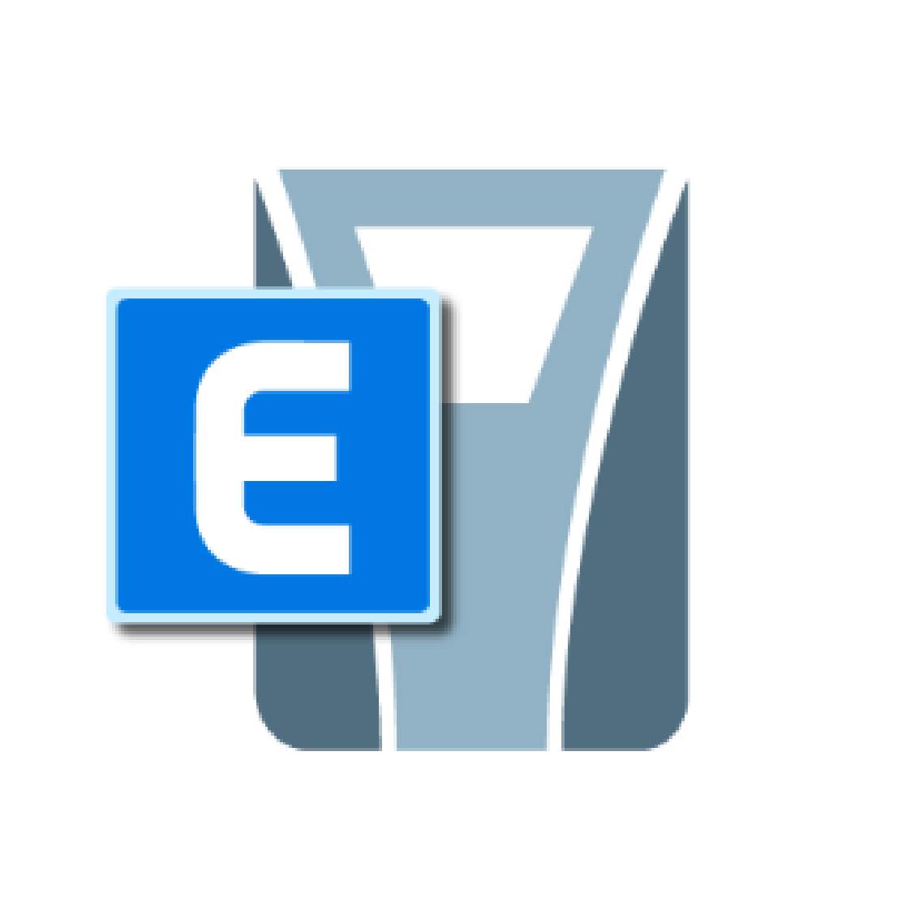
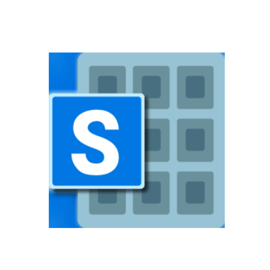

# Roberto Guevara
## Ingeniero Civil
### Acerca de mi:
#### Ingeniero Civil con Maestría en Estructuras Sismorresistentes
Profesional con sólida experiencia en el análisis y diseño de estructuras. Mi
trayectoria profesional se centra en la ingeniería estructural, donde he aplicado mis
habilidades de cálculo para garantizar la integridad y seguridad de las construcciones
Entusiasta por la automatización y programación, mi interés en la metodología BIM me impulsa a explorar soluciones innovadoras para el diseño y la construcción

* 🌍  Soy de Ecuador
* ✉️  Contactame a [raguevara98@gmail.com](mailto:raguevara98@gmail.com)
* 🚀  Actualmente trabajo como [freelancer](http://my.app)
* 🧠  Interesado en diseño estructural, programación & BIM

---
### Habilidades

### Connect with me:

 <a href="https://www.linkedin.com/in/roberto-guevara-valenzuela-53234b207" target="_blank" rel="noreferrer"> <picture> <source media="(prefers-color-scheme: dark)" srcset="https://raw.githubusercontent.com/danielcranney/readme-generator/main/public/icons/socials/linkedin-dark.svg" /> <source media="(prefers-color-scheme: light)" srcset="https://raw.githubusercontent.com/danielcranney/readme-generator/main/public/icons/socials/linkedin.svg" />  </picture> </a>

